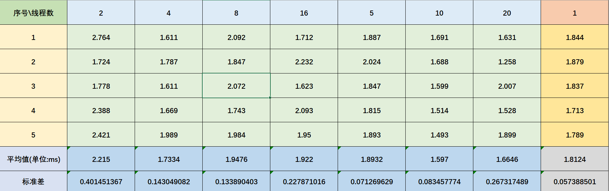
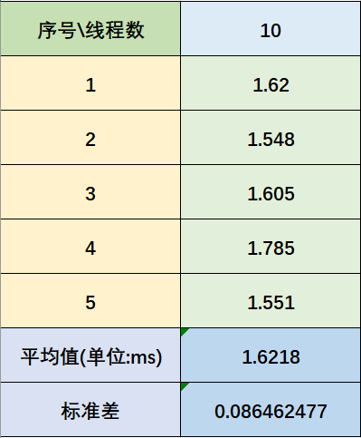

# 作业3  

## 姓名：王泽黎 &nbsp; 学号：2022K8009929011  

### 3.1  

（1）C程序代码：

    #include <stdio.h>
    #include <stdlib.h>
    #include <time.h>
    #define ARRAY_SIZE 1000000
    int main() {
        // 创建一个大小为 100 万的整数数组
        int *array = (int *)malloc(ARRAY_SIZE * sizeof(int));
        if (array == NULL) {
            printf("内存分配失败\n");
            return 1;
        }

        // 初始化数组
        for (int i = 0; i < ARRAY_SIZE; i++) {
            array[i] = i + 1;
        }

        // 记录开始时间
        struct timespec start, end;
        clock_gettime(CLOCK_REALTIME, &start);

        // 求和
        long long sum = 0;
        for (int i = 0; i < ARRAY_SIZE; i++) {
            sum += array[i];
        }

        // 记录结束时间
        clock_gettime(CLOCK_REALTIME, &end);

        // 计算耗时
        double time_spent = (end.tv_sec - start.tv_sec) + (end. tv_nsec - start.tv_nsec) / 1000000000.0;

        // 打印结果
        printf("求和结果: %lld\n", sum);
        printf("求和操作耗时: %f 秒\n", time_spent);

        // 释放内存
        free(array);

        return 0;
    }
打印结果：
  

（2）C程序代码：

    #include <stdio.h>
    #include <stdlib.h>
    #include <pthread.h>
    #include <time.h>
    #define ARRAY_SIZE 1000000
    #define NUM_THREADS 20 // 线程数量，可以根据需要调整

    int array[ARRAY_SIZE];
    long long partial_sums[NUM_THREADS] = {0}; // 每个线程的部分和

    void *sum_array(void *arg) {
        int thread_id = *(int *)arg;
        int start = thread_id * (ARRAY_SIZE / NUM_THREADS);
        int end = (thread_id + 1) * (ARRAY_SIZE / NUM_THREADS);

        for (int i = start; i < end; i++) {
            partial_sums[thread_id] += array[i];
        }

        pthread_exit(NULL);
    }

    int main() {
        // 初始化数组
        for (int i = 0; i < ARRAY_SIZE; i++) {
            array[i] = i + 1;
        }

        pthread_t threads[NUM_THREADS];
        int thread_ids[NUM_THREADS];

        // 记录开始时间
        struct timespec start, end;
        clock_gettime(CLOCK_REALTIME, &start);

        // 创建线程
        for (int i = 0; i < NUM_THREADS; i++) {
            thread_ids[i] = i;
            int rc = pthread_create(&threads[i], NULL, sum_array,   (void *)&thread_ids[i]);
            if (rc) {
                printf("Error:无法创建线程 %d\n", rc);
                exit(-1);
            }
        }

        // 等待所有线程完成
        for (int i = 0; i < NUM_THREADS; i++) {
            pthread_join(threads[i], NULL);
        }

        // 计算总和
        long long total_sum = 0;
        for (int i = 0; i < NUM_THREADS; i++) {
            total_sum += partial_sums[i];
        }

        // 记录结束时间
        clock_gettime(CLOCK_REALTIME, &end);

        // 计算耗时
        double time_spent = (end.tv_sec - start.tv_sec) + (end. tv_nsec - start.tv_nsec) / 1000000000.0;

        // 打印结果
        printf("求和结果: %lld\n", total_sum);
        printf("求和操作耗时: %f 秒\n", time_spent);

        return 0;
    }
打印结果(使用Linux系统的CPU核数为20)：  

根据所得数据，可以看出线程数越多，平均求和耗时并非越短，而是在一定范围内波动。其中10线程的平均求和耗时最短，20线程虽然出现了最短的求和耗时，但是波动较大，不稳定。以10线程与单线程对比，10线程的平均求和耗时明显短于单线程。笔者推测，线程数过多会导致线程切换频繁，从而增加了求和操作的耗时，线程数过少则会导致CPU资源利用不足，无法充分发挥多线程的优势，进而呈现出平均求和耗时较长的情况。

（3）C程序代码：

    #define _USE_GNU
    #define _GNU_SOURCE
    #include <pthread.h>
    #include <sched.h>
    #include <stdio.h>
    #include <stdlib.h>
    #include <time.h>
    #include <unistd.h>
    #define ARRAY_SIZE 1000000
    #define NUM_THREADS 10 // 线程数量，可以根据需要调整

    int CPU_CORES = 0; // CPU 核心编号
    int array[ARRAY_SIZE];
    long long partial_sums[NUM_THREADS] = {0}; // 每个线程的部分和

    void *sum_array(void *arg) {
        cpu_set_t cpuset;   //CPU 核的位图 
        CPU_ZERO(&cpuset);  //清空
        CPU_SET(CPU_CORES, &cpuset); //设置CPU 核心编号
        CPU_CORES++; //下一个线程绑定到下一个 CPU 核心
        sched_setaffinity(0, sizeof(cpuset), &cpuset); //设置 CPU   亲和力

        int thread_id = *(int *)arg;
        int start = thread_id * (ARRAY_SIZE / NUM_THREADS);
        int end = (thread_id + 1) * (ARRAY_SIZE / NUM_THREADS);

        for (int i = start; i < end; i++) {
            partial_sums[thread_id] += array[i];
        }

        pthread_exit(NULL);
    }

    int main() {
        // 初始化数组
        for (int i = 0; i < ARRAY_SIZE; i++) {
            array[i] = i + 1;
        }

        pthread_t threads[NUM_THREADS];
        int thread_ids[NUM_THREADS];

        // 记录开始时间
        struct timespec start, end;
        clock_gettime(CLOCK_REALTIME, &start);

        // 创建线程
        for (int i = 0; i < NUM_THREADS; i++) {
            thread_ids[i] = i;
            int rc = pthread_create(&threads[i], NULL, sum_array,   (void *)&thread_ids[i]);
            if (rc) {
                printf("Error:无法创建线程 %d\n", rc);
                exit(-1);
            }
        }

        // 等待所有线程完成
        for (int i = 0; i < NUM_THREADS; i++) {
            pthread_join(threads[i], NULL);
        }

        // 计算总和
        long long total_sum = 0;
        for (int i = 0; i < NUM_THREADS; i++) {
            total_sum += partial_sums[i];
        }

        // 记录结束时间
        clock_gettime(CLOCK_REALTIME, &end);

        // 计算耗时
        double time_spent = (end.tv_sec - start.tv_sec) + (end. tv_nsec - start.tv_nsec) / 1000000000.0;

        // 打印结果
        printf("求和结果: %lld\n", total_sum);
        printf("求和操作耗时: %f 秒\n", time_spent);

        return 0;
    }
打印结果(使用线程数为10)：

根据所得数据，可以看出，通过设置线程与CPU核心的亲和力，并未明显提升求和操作的耗时。笔者推测，可能是因为CPU核心的数量较少，线程与CPU核心的亲和力并未发挥出明显的优势。

### 3.2  

（1）C程序代码：

    #include <stdio.h>
    #include <stdlib.h>
    #include <pthread.h>
    #define ARRAY_SIZE 1000000  // 数组大小
    #define NUM_THREADS 10      // 线程数量

    int array[ARRAY_SIZE];

    typedef struct {
        int start;
        int end;
    } ThreadData;

    void* fill_array(void* arg) {
        ThreadData* data = (ThreadData*)arg;
        for (int i = data->start; i < data->end; i++) {
            array[i] = i + 1;
        }
        pthread_exit(NULL);
    }

    int main() {
        pthread_t threads[NUM_THREADS];
        ThreadData thread_data[NUM_THREADS];
        int segment_size = ARRAY_SIZE / NUM_THREADS;

        // 创建线程
        for (int i = 0; i < NUM_THREADS; i++) {
            thread_data[i].start = i * segment_size;
            thread_data[i].end = (i + 1) * segment_size;
            pthread_create(&threads[i], NULL, fill_array, (void*)&  thread_data[i]);
        }

        // 等待所有线程完成
        for (int i = 0; i < NUM_THREADS; i++) {
            pthread_join(threads[i], NULL);
        }

        // 主进程求和
        long long sum = 0;
        for (int i = 0; i < ARRAY_SIZE; i++) {
            sum += array[i];
        }

        printf("Sum of array elements: %lld\n", sum);

        return 0;
    }

打印结果：
