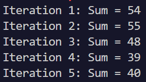

# 作业5

## 姓名：王泽黎 &nbsp; 学号：2022K8009929011  

### 5.1

（1）&（2）（临界区请见代码注释）

Peterson 算法源代码：

```c
#include <stdio.h>
#include <pthread.h>
#include <stdlib.h>
#include <limits.h>

#define MAX 10000000
#define CHUNK_SIZE 200

int data[MAX];
int current_index = 0;
int turn;
int flag[2] = {0, 0};

void enter_critical_section(int self) {
    flag[self] = 1;
    turn = 1 - self;
    while (flag[1 - self] && turn == 1 - self);
}

void leave_critical_section(int self) {
    flag[self] = 0;
}

void* write_even(void* arg) {
    for (int i = 0; i < MAX; i += 400) {
        enter_critical_section(0);
        
// 临界区
/////////////////////////////////////////////////////////////////////////////////////////////////////////

        for (int j = 0; j < CHUNK_SIZE && current_index < MAX; j++) {
            data[current_index] = i + j * 2;
            current_index++;
        }

/////////////////////////////////////////////////////////////////////////////////////////////////////////

        leave_critical_section(0);
    }
    return NULL;
}

void* write_odd(void* arg) {
    for (int i = 0; i < MAX; i += 400) {
        enter_critical_section(1);

// 临界区
/////////////////////////////////////////////////////////////////////////////////////////////////////////

        for (int j = 0; j < CHUNK_SIZE && current_index < MAX; j++) {
            data[current_index] = i + j * 2 + 1;
            current_index++;
        }

/////////////////////////////////////////////////////////////////////////////////////////////////////////

        leave_critical_section(1);
    }
    return NULL;
}

int main() {
    pthread_t thread1, thread2;

    pthread_create(&thread1, NULL, write_even, NULL);
    pthread_create(&thread2, NULL, write_odd, NULL);

    pthread_join(thread1, NULL);
    pthread_join(thread2, NULL);

    int max_diff = 0;
    for (int i = 1; i < MAX; i++) {
        int diff = abs(data[i] - data[i - 1]);
        if (diff > max_diff) {
            max_diff = diff;
        }
    }

    printf("最大绝对差值: %d\n", max_diff);
    return 0;
}
```

Peterson 算法运行截图：


pthread_mutex_lock/unlock()函数源代码：

```c
#include <stdio.h>
#include <pthread.h>
#include <stdlib.h>
#include <limits.h>

#define MAX 10000000
#define CHUNK_SIZE 200

int data[MAX];
int current_index = 0;
pthread_mutex_t mutex = PTHREAD_MUTEX_INITIALIZER;

void* write_even(void* arg) {
    for (int i = 0; i < MAX; i += 400) {
        pthread_mutex_lock(&mutex);

// 临界区
/////////////////////////////////////////////////////////////////////////////////////////////////////////

        for (int j = 0; j < CHUNK_SIZE && current_index < MAX; j++) {
            data[current_index] = i + j * 2;
            current_index++;
        }

/////////////////////////////////////////////////////////////////////////////////////////////////////////

        pthread_mutex_unlock(&mutex);
    }
    return NULL;
}

void* write_odd(void* arg) {
    for (int i = 0; i < MAX; i += 400) {
        pthread_mutex_lock(&mutex);

// 临界区
/////////////////////////////////////////////////////////////////////////////////////////////////////////

        for (int j = 0; j < CHUNK_SIZE && current_index < MAX; j++) {
            data[current_index] = i + j * 2 + 1;
            current_index++;
        }

/////////////////////////////////////////////////////////////////////////////////////////////////////////

        pthread_mutex_unlock(&mutex);
    }
    return NULL;
}

int main() {
    pthread_t thread1, thread2;

    pthread_create(&thread1, NULL, write_even, NULL);
    pthread_create(&thread2, NULL, write_odd, NULL);

    pthread_join(thread1, NULL);
    pthread_join(thread2, NULL);

    int max_diff = 0;
    for (int i = 1; i < MAX; i++) {
        int diff = abs(data[i] - data[i - 1]);
        if (diff > max_diff) {
            max_diff = diff;
        }
    }

    printf("最大绝对差值: %d\n", max_diff);
    pthread_mutex_destroy(&mutex);
    return 0;
}
```

pthread_mutex_lock/unlock()函数运行截图：


__atomic_add_fetch函数源代码：

```c
#include <stdio.h>
#include <pthread.h>
#include <stdlib.h>
#include <limits.h>

#define MAX 10000000
#define CHUNK_SIZE 200

int data[MAX];
int current_index = 0;

void* write_even(void* arg) {
    for (int i = 0; i < MAX; i += 400) {

// 临界区
/////////////////////////////////////////////////////////////////////////////////////////////////////////

        for (int j = 0; j < CHUNK_SIZE && __atomic_add_fetch(&current_index, 0, __ATOMIC_SEQ_CST) < MAX; j++) {
            int idx = __atomic_add_fetch(&current_index, 1, __ATOMIC_SEQ_CST) - 1;
            data[idx] = i + j * 2;
        }

/////////////////////////////////////////////////////////////////////////////////////////////////////////

    }
    return NULL;
}

void* write_odd(void* arg) {
    for (int i = 0; i < MAX; i += 400) {

// 临界区
/////////////////////////////////////////////////////////////////////////////////////////////////////////

        for (int j = 0; j < CHUNK_SIZE && __atomic_add_fetch(&current_index, 0, __ATOMIC_SEQ_CST) < MAX; j++) {
            int idx = __atomic_add_fetch(&current_index, 1, __ATOMIC_SEQ_CST) - 1;
            data[idx] = i + j * 2 + 1;
        }

/////////////////////////////////////////////////////////////////////////////////////////////////////////

    }
    return NULL;
}

int main() {
    pthread_t thread1, thread2;

    pthread_create(&thread1, NULL, write_even, NULL);
    pthread_create(&thread2, NULL, write_odd, NULL);

    pthread_join(thread1, NULL);
    pthread_join(thread2, NULL);

    int max_diff = 0;
    for (int i = 1; i < MAX; i++) {
        int diff = abs(data[i] - data[i - 1]);
        if (diff > max_diff) {
            max_diff = diff;
        }
    }

    printf("最大绝对差值: %d\n", max_diff);
    return 0;
}
```

__atomic_add_fetch函数运行截图：


（3）


### 5.2

源代码：

```c
#include <stdio.h>
#include <pthread.h>
#include <stdlib.h>
#include <time.h>

#define ARRAY_SIZE 5
#define NUM_ITERATIONS 5

int array[ARRAY_SIZE];
pthread_mutex_t mutex = PTHREAD_MUTEX_INITIALIZER;
pthread_cond_t cond = PTHREAD_COND_INITIALIZER;
int ready = 0;

void* write_random_numbers(void* arg) {
    for (int iter = 0; iter < NUM_ITERATIONS; iter++) {
        pthread_mutex_lock(&mutex);

        // 写入随机数
        for (int i = 0; i < ARRAY_SIZE; i++) {
            array[i] = rand() % 20 + 1;
        }

        ready = 1;
        pthread_cond_signal(&cond);
        pthread_mutex_unlock(&mutex);

        // 等待线程2读取并求和
        pthread_mutex_lock(&mutex);
        while (ready == 1) {
            pthread_cond_wait(&cond, &mutex);
        }
        pthread_mutex_unlock(&mutex);
    }
    return NULL;
}

void* read_and_sum(void* arg) {
    for (int iter = 0; iter < NUM_ITERATIONS; iter++) {
        pthread_mutex_lock(&mutex);
        while (ready == 0) {
            pthread_cond_wait(&cond, &mutex);
        }

        // 读取并求和
        int sum = 0;
        for (int i = 0; i < ARRAY_SIZE; i++) {
            sum += array[i];
        }
        printf("Iteration %d: Sum = %d\n", iter + 1, sum);

        ready = 0;
        pthread_cond_signal(&cond);
        pthread_mutex_unlock(&mutex);
    }
    return NULL;
}

int main() {
    srand(time(NULL));
    pthread_t thread1, thread2;

    pthread_create(&thread1, NULL, write_random_numbers, NULL);
    pthread_create(&thread2, NULL, read_and_sum, NULL);

    pthread_join(thread1, NULL);
    pthread_join(thread2, NULL);

    pthread_mutex_destroy(&mutex);
    pthread_cond_destroy(&cond);

    return 0;
}
```

运行截图：

