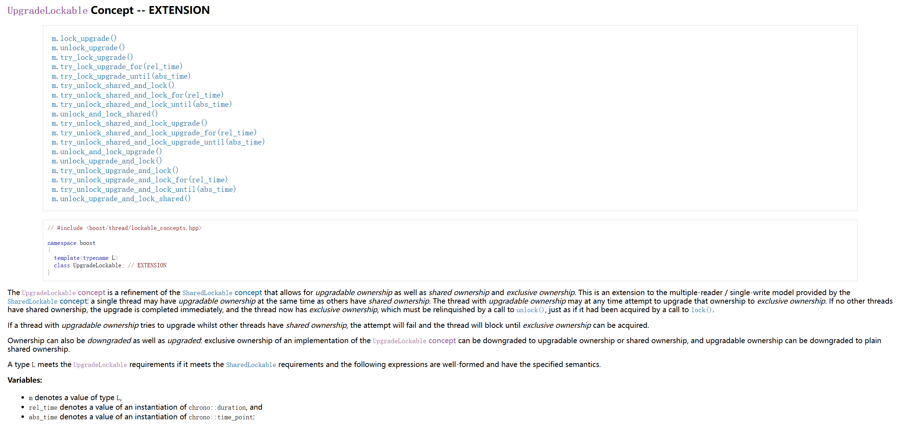

# 读写锁

## 1. 读写锁的由来

读写锁（readers and single writer lock）是一种同步机制，允许多个线程同时读取共享资源，但在写入共享资源时，必须独占访问。读写锁的设计目的是提高并发性和性能，特别是在读操作远多于写操作的场景下

## 2. 读写锁的特性

- 读锁（共享锁）：多个线程可以同时持有读锁，允许并发读取
- 写锁（独占锁）：只有一个线程可以持有写锁，写锁会阻塞其他读锁和写锁的获取
- 升级和降级：某些实现允许将读锁升级为写锁或将写锁降级为读锁
  
  [参考文档](https://www.boost.org/doc/libs/1_86_0/doc/html/thread/synchronization.html#thread.synchronization.mutex_concepts.upgrade_lockable)

## 3. 读写锁的基本原理

- 允许多个读者同时访问共享资源，不允许读者和写者同时访问资源；写者在进行写操作时要独占资源
- 读操作：
  - 如果没有写者持有锁，且没有任何写者正在等待获取锁（写者优先），那么读者可以获得读锁并访问共享资源
  - 如果没有写者持有锁，那么读者可以获得读锁并访问共享资源（读者优先）
- 写操作：如果没有写者持有锁，且所有持有的读锁都已释放，则可以获得写锁

## 4. 读写锁的使用场景

读写锁适用于读操作频繁、写操作较少的场景，例如：

- 缓存系统
- 配置文件读取
- 数据库查询

## 5. Linux Kernel 中的读写锁

Linux Kernel 中的读写锁主要有两种类型：基于自旋锁的读写锁和基于信号量的读写锁。

此处基于 Linux Kernel 6.11.4 版本的源码，简要介绍基于 spinlock 的读写锁的实现。

### 1.`arch_spinlock_t` 数据结构

`arch_spinlock_t`是一个自旋锁的数据结构，定义在 spinlock_types.h 文件中

```c
typedef struct {
    union {
        u32 slock;
        struct __raw_tickets {
#ifdef __ARMEB__
            u16 next;
            u16 owner;
#else
            u16 owner;
            u16 next;
#endif
        } tickets;
    };
} arch_spinlock_t;
```

`slock`：一个32位的整数，用于表示自旋锁的状态。
`tickets`：一个包含两个16位整数的结构体，用于实现公平自旋锁。`owner` 表示当前持有锁的线程，`next` 表示下一个等待获取锁的线程。

**支持的操作：**

`__ARCH_SPIN_LOCK_UNLOCKED`：初始化一个未锁定的自旋锁。

```c
#define __ARCH_SPIN_LOCK_UNLOCKED	{ { 0 } }
```

### 2.`arch_rwlock_t` 数据结构

`arch_rwlock_t` 是一个读写锁的数据结构，定义在 spinlock_types.h 文件中。

```c
typedef struct {
    u32 lock;
} arch_rwlock_t;
```

`lock`：一个32位的整数，用于表示读写锁的状态。

**支持的操作：**

`__ARCH_RW_LOCK_UNLOCKED`：初始化一个未锁定的读写锁。

```c
#define __ARCH_RW_LOCK_UNLOCKED	{ 0 }
```

### 3.`rwlock_t` 数据结构

`rwlock_t` 是一个通用的读写锁数据结构，定义在 rwlock_types.h 文件中。

```c
typedef struct {
    arch_rwlock_t raw_lock;
#ifdef CONFIG_DEBUG_SPINLOCK
    unsigned int magic, owner_cpu;
    void *owner;
#endif
#ifdef CONFIG_DEBUG_LOCK_ALLOC
    struct lockdep_map dep_map;
#endif
} rwlock_t;
```

`raw_lock`：底层的 `arch_rwlock_t` 锁

**支持的操作：**

`__RW_LOCK_UNLOCKED`：初始化一个未锁定的读写锁。

```c
#ifdef CONFIG_DEBUG_SPINLOCK
#define __RW_LOCK_UNLOCKED(lockname)					\
	(rwlock_t)	{	.raw_lock = __ARCH_RW_LOCK_UNLOCKED,	\
				.magic = RWLOCK_MAGIC,			\
				.owner = SPINLOCK_OWNER_INIT,		\
				.owner_cpu = -1,			\
				RW_DEP_MAP_INIT(lockname) }
#else
#define __RW_LOCK_UNLOCKED(lockname) \
	(rwlock_t)	{	.raw_lock = __ARCH_RW_LOCK_UNLOCKED,	\
				RW_DEP_MAP_INIT(lockname) }
#endif
```

`DEFINE_RWLOCK`：定义并初始化一个读写锁。

```c
#define DEFINE_RWLOCK(x)	rwlock_t x = __RW_LOCK_UNLOCKED(x)
```

### 4.rwlock相关操作

这些操作定义在 rwlock.h 文件中。

```c
#define read_trylock(lock)	__cond_lock(lock, _raw_read_trylock(lock))
#define write_trylock(lock)	__cond_lock(lock, _raw_write_trylock(lock))

#define write_lock(lock)	_raw_write_lock(lock)
#define read_lock(lock)		_raw_read_lock(lock)

#define read_lock_irqsave(lock, flags)			\
    do {						\
        typecheck(unsigned long, flags);	\
        flags = _raw_read_lock_irqsave(lock);	\
    } while (0)
#define write_lock_irqsave(lock, flags)			\
    do {						\
        typecheck(unsigned long, flags);	\
        flags = _raw_write_lock_irqsave(lock);	\
    } while (0)

#define read_lock_irq(lock)		_raw_read_lock_irq(lock)
#define read_lock_bh(lock)		_raw_read_lock_bh(lock)
#define write_lock_irq(lock)		_raw_write_lock_irq(lock)
#define write_lock_bh(lock)		_raw_write_lock_bh(lock)
#define read_unlock(lock)		_raw_read_unlock(lock)
#define write_unlock(lock)		_raw_write_unlock(lock)
#define read_unlock_irq(lock)		_raw_read_unlock_irq(lock)
#define write_unlock_irq(lock)		_raw_write_unlock_irq(lock)

#define read_unlock_irqrestore(lock, flags)			\
    do {							\
        typecheck(unsigned long, flags);		\
        _raw_read_unlock_irqrestore(lock, flags);	\
    } while (0)

#define write_unlock_irqrestore(lock, flags)		\
    do {						\
        typecheck(unsigned long, flags);		\
        _raw_write_unlock_irqrestore(lock, flags);	\
    } while (0)

#define write_trylock_irqsave(lock, flags) \
({ \
	local_irq_save(flags); \
	write_trylock(lock) ? \
	1 : ({ local_irq_restore(flags); 0; }); \
})
```

`read_trylock(lock)`：尝试获取读锁。
`write_trylock(lock)`：尝试获取写锁。
`write_lock(lock)`：获取写锁。
`read_lock(lock)`：获取读锁。
`read_lock_irqsave(lock, flags)`：在禁用中断的情况下获取读锁，并保存中断状态。
`write_lock_irqsave(lock, flags)`：在禁用中断的情况下获取写锁，并保存中断状态。
`read_lock_irq(lock)`：在禁用中断的情况下获取读锁。
`read_lock_bh(lock)`：在禁用软中断的情况下获取读锁。
`write_lock_irq(lock)`：在禁用中断的情况下获取写锁。
`write_lock_bh(lock)`：在禁用软中断的情况下获取写锁。
`read_unlock(lock)`：释放读锁。
`write_unlock(lock)`：释放写锁。
`read_unlock_irq(lock)`：在恢复中断的情况下释放读锁。
`write_unlock_irq(lock)`：在恢复中断的情况下释放写锁。
`read_unlock_irqrestore(lock, flags)`：恢复中断状态并释放读锁。
`write_unlock_irqrestore(lock, flags)`：恢复中断状态并释放写锁。
`write_trylock_irqsave(lock, flags)`：在禁用中断的情况下尝试获取写锁，并保存中断状态。
